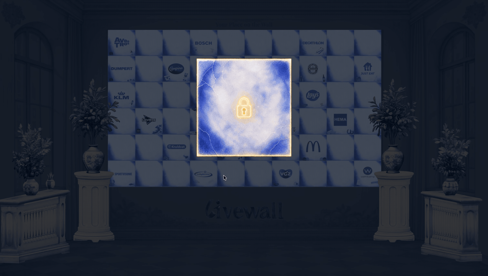

# Digital Thank You - Your Place On The Wall

Next.js WebGL experience for Livewall: a premium Delft Blue appreciation wall where partner tiles become part of a cinematic digital monument.

## Preview

**Live:** [digital-thank-you.vercel.app](https://digital-thank-you.vercel.app)  
**Activation code:** `12345`

<p>
  
   
  
</p>

## Features

### Experience

- **Cinematic loading animation** — canvas wipe with logos; waits for asset preload and the first WebGL frame
- **3D building entrance** — camera flight through the Livewall building (GLB) with fade into the activation room
- **Code activation** — enter a 5-digit code; 3D door opens on valid code
- **Delft Blue tile wall** — WebGL wall of 10×6 tiles (60 partners) with ceramic textures
- **Interactive tile** — inspect, rotate and subtly move the floating tile
- **Placement moment** — shockwave, particles, golden light and ceramic sound when placing the tile on the wall
- **Scrollytelling lookback** — auto-scroll through three narrative panels after placement
- **Room decor** — 3D vases and pillars with glow and impact animations

### Technical

- **GLB export** — download your tile as a 3D file
- **Replaceable assets** — logos, textures, audio and data via `public/assets`
- **GSAP hints** — animated text hints throughout the flow
- **Vercel deploy** — automatic build on push to `main`

### Prototype (local)

- **AI tile generation** — chat-driven tile via LM Studio (`wip/generative-ui` branch, not live on Vercel)

## Stack


## Development

```bash
npm install
npm run dev
```

Open [http://localhost:3000](http://localhost:3000).

> **Note:** `Livewall-gebouw.glb` is listed in `.gitignore` due to file size (~298 MB). Request this file from one of the team members.

## Replaceable content

Assets live in `public/assets`:

- `logos`
- `textures`
- `audio`
- `data`
- `videos`

## Project structure

```
DigitalThankYou/
├── app/                    # layout, page, globals.css
├── src/
│   ├── components/         # scenes + ui/ (download, lookback buttons)
│   └── lib/                # download-tile.js
├── public/assets/          # audio, data, figma, models, textures, video
└── docs/                   # README.md, overdracht.md
```

AI prototype on `wip/generative-ui`: `app/workspace/`, `app/api/ai/`, `src/components/ai/`, `src/lib/ai/`.

> Details: [overdracht.md](overdracht.md)

## Documentation

See [overdracht.md](overdracht.md) for architecture, AI prototype, deployment and handover notes.

**Team:** Babita Alting, Daaf Heijnekamp, Gianna Beenen, Ouassila Ben Hammou, Yusuf Sels

<details>
<summary>Product Brief</summary>

Build an immersive premium web experience called **Digital Thank You Wall** for Livewall.

The experience should feel like a mix between a luxury interactive museum installation, a cinematic WebGL website, a premium Dutch Delft Blue digital artwork, and an interactive appreciation wall for partners and sponsors.

The user enters a dark cinematic environment. In the center is a large Delft Blue tiled wall made of glossy ceramic tiles. Each tile represents a partner. The wall should feel premium, slightly mysterious, artistic, alive and reactive. This is not a game and not a normal website. It should feel elegant, emotional and high-end.

One special tile floats in front of the wall. The user can hover, inspect, rotate and subtly move it with pointer or touch. After a few seconds or after interaction, the tile slowly moves toward the wall. When it enters the wall, nearby tiles push outward, a circular shockwave travels through the ceramic surface, particles appear, warm golden light leaks between seams, and a minimal ceramic sound confirms the moment.

The visual direction is Delft Blue ceramic, Dutch luxury, museum lighting, soft fog, dark navy atmosphere, white ceramic surfaces, warm gold highlights and handcrafted imperfections. Motion should be slow, physical and cinematic — never explosive, arcade-like or cartoonish.

Use placeholder assets everywhere so final logos, textures, videos, branding and audio can be replaced later without changing the codebase.

</details>
