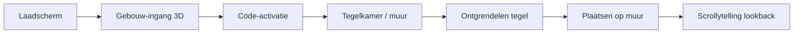

# Overdrachtsdocument 

### Digital Thank You - Your Place On The Wall

**Opdrachtgever:** Livewall  
**Datum:** 28 mei 2026  
**Groepsleden:** Babita Alting, Daaf Heijnekamp, Gianna Beenen, Ouassila Ben Hammou, Yusuf Sels  
**Status:** Prototype afgerond. AI-functionaliteiten, definitieve assets en content dienen nog vervangen/geïmplementeerd te worden.  
**Live URL:** [https://digital-thank-you.vercel.app/](https://digital-thank-you.vercel.app/)  
**Hosting:** Vercel (gekoppeld aan GitHub-repo, automatische deploy bij push naar main)

**Technologie**

- Next.js 15 (App Router)
- React 19
- Three.js (imperatief, geen React Three Fiber in de huidige implementatie)
- GSAP (+ SplitText voor hint-animaties)
- Tailwind CSS 4
- Lucide React (iconen)

## Inhoudsopgave

1. [Projectoverzicht](#1-projectoverzicht)
2. [Doel en concept](#2-doel-en-concept)
3. [Gebruikersflow](#3-gebruikersflow)
4. [Architectuur en mapstructuur](#4-architectuur-en-mapstructuur)
5. [Componenten](#5-componenten)
6. [Assets en content](#6-assets-en-content)
7. [Configuratie en constanten](#7-configuratie-en-constanten)
8. [Lokale ontwikkeling](#8-lokale-ontwikkeling)
9. [Hosting, build en deployment](#9-hosting-build-en-deployment)
10. [AI-prototype (lokaal)](#10-ai-prototype-lokaal)
11. [Openstaande punten](#11-openstaande-punten)
12. [Aandachtspunten bij overdracht](#12-aandachtspunten-bij-overdracht)

---

## 1. Projectoverzicht

**Digital Thank You Wall** is een premium WebGL-ervaring voor Livewall: een cinematische Delft Blue waarderingsmuur waar partner-tegels onderdeel worden van een digitaal monument. De ervaring voelt als een luxe museuminstallatie — donker, cinematisch, met keramische tegels, gouden accenten en langzame, fysieke animaties.

De applicatie draait als één Next.js-pagina (`/`) zonder backend. Alle partnerdata, texturen, modellen en audio staan in `public/assets`. De root component `DigitalThankYouWall` orkestreert de volledige scèneverloop via React state.

---

## 2. Doel en concept

| Aspect                    | Beschrijving                                                                                                   |
| ------------------------- | -------------------------------------------------------------------------------------------------------------- |
| **Doelgroep**             | Partners en sponsors van Livewall                                                                              |
| **Kernmoment**            | Gebruiker ontgrendelt een persoonlijke tegel, plaatst die op de muur, en verkent daarna de volledige tegelwand |
| **Visuele richting**      | Delft Blue keramiek, donker navy, warm goud, museumverlichting, handgemaakte imperfecties                      |
| **Motion**                | Langzaam, cinematisch, fysiek — nooit arcade-achtig                                                            |
| **Placeholder-strategie** | Alle logo's, texturen, video's en audio zijn vervangbaar zonder codewijzigingen                                |

---

## 3. Gebruikersflow

De ervaring bestaat uit een vaste sequentie van schermen. Overgangen worden beheerd in `digital-thank-you-wall.jsx`.



### 1. Laadscherm (`LoadingAnimation`)

- Canvas-animatie met twee logo-varianten en een golf-wipe.
- Verdwijnt pas als **drie voorwaarden** tegelijk waar zijn:
  1. Alle assets voorgeladen (afbeeldingen + 3D-model)
  2. WebGL-muurscène heeft eerste frame getekend
  3. Laadanimatie heeft minimumduur afgerond

### 2. Gebouw-ingang (`EntryBuildingModel`)

- 3D-vlucht door het Livewall-gebouw (GLB-model).
- Camera vliegt naar de deur; witte fade-overlay bij ~38% van de animatie.
- Duur: ~2s hold + ~3,2s vlucht.

### 3. Code-activatie (`CodeActivationScene`)

- Gebruiker vult een 5-cijferige code in.
- **Prototype-code:** `12345` (hardcoded in `code-activation-scene.jsx`).
- Bij correcte code: 3D-deur opent, scène gaat door naar de tegelkamer.

### 4. Tegelkamer / muur (`HeroScene` + decor)

- Achtergrond: statische kamerafbeelding (`livewall-room.png`).
- 3D-decor: vazen en pilaren (`RoomDecorModels`).
- WebGL-muur: 10×6 tegelraster (60 tegels) met partner-SVG's.
- Timing na binnenkomst:
  - **7s** — muur start invlieganimatie
  - **15s** — locked glow op centrale tegel

### 5. Ontgrendelen en plaatsen tegel

- Hint: _"Unlock your tile"_ → klik op de gloeiende tegel.
- Zwevende tegel: hover, inspect, roteren, subtiel verplaatsen.
- Download-knop: exporteert tegel als `.glb` (`download-tile.js`).
- Plaatsing op muur: shockwave, deeltjes, gouden licht, keramisch geluid (`dropsound.mp3`).

### 6. Scrollytelling lookback (`TileScrollytellingFrame`)

- Na plaatsing: knop _"Let's take a look back"_.
- Auto-scroll door drie verhalende panelen (~44s).
- Keramische drip-animatie over de muur tijdens lookback.

---

## 4. Architectuur en mapstructuur

```
DigitalThankYou/
├── app/
│   ├── layout.jsx          # Root layout, metadata, fonts
│   ├── page.jsx            # Entry point → DigitalThankYouWall
│   └── globals.css         # Tailwind + alle scene-styling (~1500 regels)
├── src/
│   ├── components/
│   │   ├── digital-thank-you-wall.jsx   # Root orchestrator
│   │   ├── hero-scene.jsx               # WebGL muur + interactieve tegel (~2900 regels)
│   │   ├── entry-building-model.jsx     # 3D gebouw-ingang
│   │   ├── code-activation-scene.jsx    # Code-invoer + deur
│   │   ├── room-decor-models.jsx        # Vazen, pilaren, vensterbank
│   │   ├── loading-animation.jsx        # Canvas laadscherm
│   │   ├── tile-scrollytelling-frame.jsx
│   │   └── ui/
│   │       ├── tile-download-button.jsx
│   │       └── tile-lookback-button.jsx
│   └── lib/
│       └── download-tile.js             # GLB-export via GLTFExporter
├── public/assets/
│   ├── audio/              # dropsound.mp3
│   ├── data/               # partners.json
│   ├── figma/              # UI-afbeeldingen, logo's, achtergronden
│   ├── models/decor/       # GLB-decor (deur, vazen, pilaren)
│   ├── textures/           # SVG-tegels (voor- en achterkant per merk)
│   └── video/              # Demo AI-flow (generative ui.mov)
├── docs/
│   └── OVERDRACHT.md
├── next.config.mjs
├── package.json
└── README.md
```

### State management

Er is **geen globale state library** (geen Zustand/Redux). Alle flow-state zit in `DigitalThankYouWall` via `useState`/`useCallback`. WebGL-animaties draaien imperatief in `useEffect`-hooks met refs.

### Rendering-aanpak

Hoewel `@react-three/fiber` en `@react-three/drei` in `package.json` staan, gebruikt de huidige code **imperatieve Three.js** direct in componenten. R3F is niet actief in gebruik — dependencies kunnen worden opgeschoond of later worden ingezet voor refactors.

---

## 5. Componenten

| Component                 | Verantwoordelijkheid                                                              |
| ------------------------- | --------------------------------------------------------------------------------- |
| `DigitalThankYouWall`     | Scèneverloop, asset-preload, GSAP hints, overlay-transities                       |
| `HeroScene`               | WebGL-renderer, tegelraster, zwevende tegel, shockwave, audio, pointer-interactie |
| `EntryBuildingModel`      | GLB-gebouw laden, camera-vlucht, fade naar wit                                    |
| `CodeActivationScene`     | 5-cijferige code-validatie, 3D-deur animatie                                      |
| `RoomDecorModels`         | Vazen/pilaren laden, glow-reveal, impact-animatie bij tegelplaatsing              |
| `LoadingAnimation`        | Canvas wipe-laadscherm                                                            |
| `TileScrollytellingFrame` | Lookback UI met auto-scroll panelen                                               |
| `TileDownloadButton`      | GLB-download onder zwevende tegel                                                 |
| `TileLookbackButton`      | CTA voor scrollytelling, geprojecteerd op tegelpositie                            |

---

## 6. Assets en content

### Partnerdata

Bestand: `public/assets/data/partners.json`

```json
{
  "name": "Efteling",
  "logo": "/assets/logos/givewall-placeholder.svg",
  "tileStyle": "classic"
}
```

- Eerste partner in de array = **primary partner** (centrale tegel).
- Fallback-partners staan hardcoded in `digital-thank-you-wall.jsx` als JSON niet laadt.
- **Let op:** map `public/assets/logos/` ontbreekt in de repo; paden in JSON verwijzen naar placeholders.

### Tegeltexturen

- SVG's per merk in `public/assets/textures/` (voor- én achterkant).
- Hardcoded lijst `WALL_TILE_TEXTURES` in `hero-scene.jsx` (~20 merken).
- Lege tegel, locked tegel, current brand: aparte SVG's.

### 3D-modellen

| Model           | Pad                                            | Gebruik        |
| --------------- | ---------------------------------------------- | -------------- |
| Livewall-gebouw | `/assets/models/buildings/Livewall-gebouw.glb` | Ingangsscène   |
| Deur            | `/assets/models/decor/deurCodeScene.glb`       | Code-activatie |
| Vazen/pilaren   | `/assets/models/decor/*.glb`                   | Kamerdecor     |

**Belangrijk:** `Livewall-gebouw.glb` staat in `.gitignore` (~298 MB models totaal). Dit bestand moet handmatig worden aangeleverd bij een fresh clone.

### Audio

- `public/assets/audio/dropsound.mp3` — keramisch geluid bij tegelplaatsing.
- Geladen via Web Audio API (lazy, na eerste user interactie).

### Cache-busting

`CACHE_VERSION = "v3"` in `digital-thank-you-wall.jsx` — verhogen na asset-wijzigingen om browser-cache te omzeilen.

---

## 7. Configuratie en constanten

| Constante                   | Locatie                         | Waarde    | Betekenis                    |
| --------------------------- | ------------------------------- | --------- | ---------------------------- |
| `VALID_CODE`                | `code-activation-scene.jsx`     | `"12345"` | Prototype activatiecode      |
| `TILE_COLS × TILE_ROWS`     | `hero-scene.jsx`                | 10 × 6    | Muurgrid                     |
| `CURRENT_BRAND_INDEX`       | `hero-scene.jsx`                | 24        | Rasterpositie centrale tegel |
| `ENTRY_TRANSITION_DURATION` | `digital-thank-you-wall.jsx`    | 500 ms    | Pauze na gebouw-ingang       |
| Wall entrance delay         | `digital-thank-you-wall.jsx`    | 7000 ms   | Start muur-animatie          |
| Locked glow delay           | `digital-thank-you-wall.jsx`    | 15000 ms  | Start glow op tegel          |
| `AUTOPLAY_DURATION`         | `tile-scrollytelling-frame.jsx` | 44000 ms  | Lookback scroll-duur         |

### Environment variables

Geen `.env`-variabelen vereist. De app is volledig client-side.

---

## 8. Lokale ontwikkeling

### Vereisten

- Node.js 18+
- npm

### Starten

```bash
npm install
npm run dev
```

De dev-server draait op [http://localhost:3000](http://localhost:3000).

**Let op:** het `dev`-script wist `.next` bij elke start (`rmSync`) — dit voorkomt stale cache-problemen met Three.js.

### Scripts

| Script          | Beschrijving       |
| --------------- | ------------------ |
| `npm run dev`   | Development server |
| `npm run build` | Production build   |
| `npm run start` | Production server  |

### Path aliases

`@/*` → `src/*` (geconfigureerd in `jsconfig.json`).

---

## 9. Hosting, build en deployment

### Live omgeving (Vercel)

|                    |                                                                                |
| ------------------ | ------------------------------------------------------------------------------ |
| **URL**            | [https://digital-thank-you.vercel.app/](https://digital-thank-you.vercel.app/) |
| **Platform**       | [Vercel](https://vercel.com)                                                   |
| **Framework**      | Next.js (automatisch gedetecteerd)                                             |
| **Deploy-trigger** | Push naar de gekoppelde GitHub-branch (meestal `main`)                         |

De productie-omgeving draait op Vercel. Elke merge naar de main branch triggert een nieuwe build en deployment. Preview-deployments worden aangemaakt voor pull requests.

**Vercel-dashboard:** inloggen op [vercel.com](https://vercel.com) → project **digital-thank-you** (of de gekoppelde repo-naam). Daar staan build logs, deployment history, domeininstellingen en environment variables.

### Lokale production build

```bash
npm run build
npm run start
```

Gebruik dit om lokaal te testen vóór je naar main pusht; Vercel voert dezelfde `next build` uit in de cloud.

### Aandachtspunten bij deploy

1. **GLB-gebouw** — `Livewall-gebouw.glb` staat in `.gitignore`. Zorg dat dit bestand wél in de repo of op Vercel beschikbaar is, anders faalt de ingangsscène in productie.
2. **Asset-grootte** — `public/assets` is ~470 MB (modellen + texturen). Vercel heeft limieten op deployment-grootte; grote GLB's kunnen build/deploy vertragen. Overweeg CDN, Git LFS of externe hosting voor zware assets.
3. **Geen SSR voor WebGL** — alle 3D-componenten zijn `"use client"`.
4. **Viewport** — vaste 16:10 aspect ratio (`livewall-stage`); ontworpen voor fullscreen/presentatie (TV/groot scherm).
5. **Cache-busting** — verhoog `CACHE_VERSION` in `digital-thank-you-wall.jsx` na asset-wijzigingen zodat bezoekers geen oude bestanden uit de browser-cache zien.

---

## 10. AI-prototype (lokaal)

Tijdens de ontwikkeling is ook een AI-prototype gemaakt. Met dit prototype kunnen medewerkers van LiveWall via een chat een eigen tegel laten genereren.

Dit onderdeel is gemaakt als proof of concept en draait alleen lokaal. Het is niet opgenomen in de huidige live versie die op Vercel staat.

### Status

|                         |                                                                                                                                              |
| ----------------------- | -------------------------------------------------------------------------------------------------------------------------------------------- |
| **Status**              | Prototype / proof of concept                                                                                                                 |
| **Zichtbaar op Vercel** | Nee                                                                                                                                          |
| **Waarom niet live**    | Het LLM draait via **LM Studio** op `localhost`. De browser kan geen verbinding maken met een lokaal model op de machine van de ontwikkelaar |
| **Code in repo**        | Niet gemerged in de huidige `main`-branch                                                                                                    |

### LM Studio-configuratie (getest)

| Instelling        | Waarde                                      |
| ----------------- | ------------------------------------------- |
| **Model**         | `gemma-4-e2b`                               |
| **Local server**  | `http://127.0.0.1:1234`                     |
| **API-endpoint**  | `http://127.0.0.1:1234/v1/chat/completions` |
| **Branch**        | `wip/generative-ui`                         |
| **Workspace-URL** | `http://localhost:3000/workspace`           |

Optioneel via environment variables (in `.env.local`):

```bash
LM_STUDIO_URL=http://127.0.0.1:1234/v1/chat/completions
LM_STUDIO_MODEL=gemma-4-e2b
```

Zonder `.env.local` gebruikt de API-route (`app/api/ai/route.js`) standaard `127.0.0.1:1234` en modelnaam `local-model` — zorg dat in LM Studio het geladen model overeenkomt met wat je meegeeft.

### Hoe het werkt (lokaal)

1. **LM Studio** starten en model **`gemma-4-e2b`** laden.
2. Local server inschakelen op **`http://127.0.0.1:1234`**.
3. Branch **`wip/generative-ui`** checkouten en Next.js dev-server starten (`npm run dev`).
4. Open **`/workspace`** — gebruiker voert tekst in via de AI-chat → model genereert tegeldata (tekst, stijl, etc.).
5. Gegenereerde tegel wordt getoond in een 3D-preview.

### Demo-video

Schermopname van de AI-flow (chat → tegelgeneratie → 3D-preview). Alleen lokaal getest met LM Studio; niet zichtbaar op de live site.

[Bekijk de AI-prototype demo →](https://digital-thank-you.vercel.app/assets/video/generative-ui.mp4)

### Wat nodig is voor productie

- Een **gehoste LLM-API** (OpenAI, Anthropic, Azure OpenAI, etc.) in plaats van LM Studio.
- Een **backend-route** (Next.js API route of edge function) zodat API-keys niet in de browser terechtkomen.
- Optioneel: validatie van output via een schema (JSON-structuur voor tegeldata).
- Integratie in de bestaande muur-flow (`HeroScene` / partnerdata).

---

## 11. Openstaande punten

### Nog te implementeren

- [ ] **AI-tegelgeneratie** — prototype lokaal gebouwd met LM Studio; zie [AI-prototype (lokaal)](#10-ai-prototype-lokaal). Productie-integratie met hosted LLM-API ontbreekt nog.
- [ ] **Definitieve assets** — vervang placeholder logo's, texturen, video's en branding.
- [ ] **Productie activatiecode** — vervang hardcoded `12345` door backend-validatie of unieke codes per fysieke tegel.
- [ ] **Partners.json koppeling** — muurtexturen zijn nu hardcoded in `hero-scene.jsx`; koppeling met JSON-data is nog niet dynamisch.

### Opschoning mogelijk

- [ ] Ongebruikte dependencies: `@react-three/fiber`, `@react-three/drei`, `@react-three/postprocessing`, `postprocessing`.
- [ ] `loading-animation.jsx` bevat `//test` comment en inconsistente componentnaam (`loadingAnimation` i.p.v. `LoadingAnimation`).
- [ ] Map `public/assets/logos/` aanmaken of paden in `partners.json` corrigeren.

### README vs. werkelijkheid

De `README.md` beschrijft een componentstructuur (`TileWall`, `InteractiveTile`, `ShockwaveAnimation`, etc.) die de oorspronkelijke opzet was. In de huidige code zijn deze functionaliteiten geconsolideerd in `hero-scene.jsx`.

---

## 12. Aandachtspunten bij overdracht

1. **`hero-scene.jsx` is het zwaartepunt** (~2900 regels) — muur, tegel, animaties, audio en interactie in één bestand. Refactor naar kleinere modules is aan te raden bij verdere ontwikkeling.

2. **Timing is fragiel** — scène-overgangen gebruiken meerdere `setTimeout`-ketens. Wijzig één delay alleen na visuele test van de volledige flow.

3. **GSAP SplitText** — gebruikt voor hint-teksten; vereist GSAP-licentie voor commercieel gebruik.

4. **Browser-ondersteuning** — WebGL 2, Web Audio API, `createImageBitmap`. Getest op moderne Chromium/Safari; geen expliciete IE/legacy-ondersteuning.

5. **Git LFS** — `.gitattributes` aanwezig; grote binary assets kunnen via LFS beheerd worden.

6. **Presentatie-modus** — de ervaring is ontworpen voor een vaste 16:10 stage op een groot scherm (TV/presentatie), niet primair voor responsive mobiel.

---
